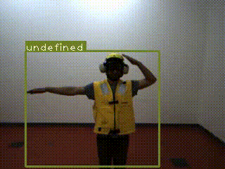

# Processing video for localization.

This is an example. Input video is made of three concatenated clips from validation set.

### Usage

Download pre-trained weight [here](https://pjreddie.com/media/files/yolov3.weights)

Save it in the Network folder.
